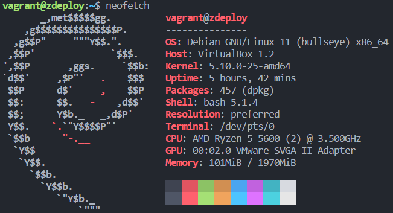

# Documentation Projet CALMS

---

## TOC

- [Documentation Projet CALMS](#documentation-projet-calms)
  - [TOC](#toc)
  - [Exercice 1 : Exécution avec chroot](#exercice-1--exécution-avec-chroot)
    - [Environnement de départ](#environnement-de-départ)
  - [Exercice 2](#exercice-2)
  - [Exercice 3](#exercice-3)

---

## Exercice 1 : Exécution avec chroot

### Environnement de départ

```bash
neofetch
```



---

## Exercice 2

---

## Exercice 3

---
