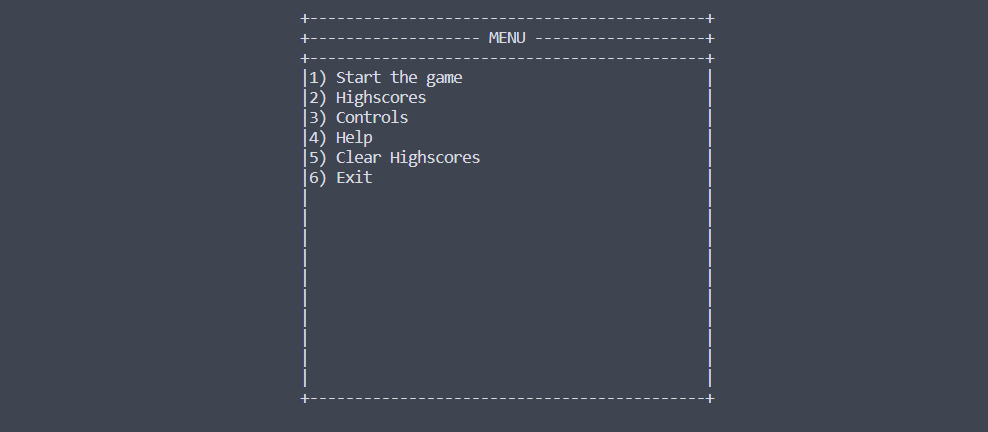

# Documentation Projet CALMS

---

## TOC

- [Documentation Projet CALMS](#documentation-projet-calms)
  - [TOC](#toc)
  - [Environnement de départ](#environnement-de-départ)
  - [Exercice 1 : Exécution avec chroot](#exercice-1--exécution-avec-chroot)
    - [Configuration du script](#configuration-du-script)
    - [Configuration de l'environnement chroot](#configuration-de-lenvironnement-chroot)
    - [Création du chroot](#création-du-chroot)
  - [Exercice 2 : Exécution sous LXC](#exercice-2--exécution-sous-lxc)
    - [Installation LXC](#installation-lxc)
    - [Création du conteneur LXC](#création-du-conteneur-lxc)
    - [TODO](#todo)
  - [Exercice 3 : Exécution sous systemd-nspawn](#exercice-3--exécution-sous-systemd-nspawn)
    - [Préparation de l'environnement](#préparation-de-lenvironnement)
    - [Création du conteneur systemd-nspawn](#création-du-conteneur-systemd-nspawn)

---

## Environnement de départ

- Machine crée via Vagrant (./Vagrant/Vagrantfile)

```bash
vagrant@zdeploy:~$ neofetch
       _,met$$$$$gg.          vagrant@zdeploy
    ,g$$$$$$$$$$$$$$$P.       ---------------
  ,g$$P"     """Y$$.".        OS: Debian GNU/Linux 11 (bullseye) x86_64
 ,$$P'              `$$$.     Host: VirtualBox 1.2
',$$P       ,ggs.     `$$b:   Kernel: 5.10.0-26-amd64
`d$$'     ,$P"'   .    $$$    Uptime: 11 mins
 $$P      d$'     ,    $$P    Packages: 492 (dpkg)
 $$:      $$.   -    ,d$$'    Shell: bash 5.1.4
 $$;      Y$b._   _,d$P'      Resolution: preferred
 Y$$.    `.`"Y$$$$P"'         Terminal: /dev/pts/0
 `$$b      "-.__              CPU: AMD Ryzen 5 5600 (2) @ 3.499GHz
  `Y$$                        GPU: 00:02.0 VMware SVGA II Adapter
   `Y$$.                      Memory: 72MiB / 1970MiB
     `$$b.
       `Y$$b.                                         
          `"Y$b._                                     
              `"""
```

---

## Exercice 1 : Exécution avec chroot

### Configuration du script

- On rend le script exécutable en utilisant la commande `chmod +x exo1.sh`
- On voit désormais grâce à `ls -l` que les permissions du script permettent de l'exécuter

```bash
vagrant@zdeploy:~$ chmod +x exo1.sh 
vagrant@zdeploy:~$ ls -l
total 4
-rwxr-xr-x 1 vagrant vagrant 921 Nov  6 22:29 exo1.sh
```

### Configuration de l'environnement chroot

- On lance le script grâce à la commande `./exo1.sh`
- Ce script va permettre :
  - Crée l'arborescence ci-dessous
  - Copier les binaires de **bash**, **ls** et **msnake**
  - Mettre les droits sur le binaire msnake
  - Copier les librairies nécessaires de **/lib** et **/lib64**
  - Copier les librairies du terminal présentent dans **/lib/terminfo**

```bash
vagrant@zdeploy:~$ tree exo1
exo1
├── bin
│   ├── bash
│   ├── ls
│   └── msnake
├── lib
│   ├── libc.so.6
│   ├── libdl.so.2
│   ├── libncurses.so.6
│   ├── libpcre2-8.so.0
│   ├── libpthread.so.0
│   ├── libselinux.so.1
│   ├── libtinfo.so.6
│   └── terminfo
│       ├── E
│       │   ├── Eterm
│       │   └── Eterm-color -> Eterm
│       ├── a
│       │   └── ansi
│       ├── c
│       │   ├── cons25
│       │   ├── cons25-debian
│       │   └── cygwin
│       ├── d
│       │   └── dumb
│       ├── h
│       │   └── hurd
│       ├── l
│       │   └── linux
│       ├── m
│       │   ├── mach
│       │   ├── mach-bold
│       │   ├── mach-color
│       │   ├── mach-gnu
│       │   └── mach-gnu-color
│       ├── p
│       │   └── pcansi
│       ├── r
│       │   ├── rxvt
│       │   ├── rxvt-basic
│       │   ├── rxvt-m -> rxvt-basic
│       │   ├── rxvt-unicode
│       │   └── rxvt-unicode-256color
│       ├── s
│       │   ├── screen
│       │   ├── screen-256color
│       │   ├── screen-256color-bce
│       │   ├── screen-bce
│       │   ├── screen-s
│       │   ├── screen-w
│       │   ├── screen.xterm-256color
│       │   └── sun
│       ├── t
│       │   ├── tmux
│       │   └── tmux-256color
│       ├── v
│       │   ├── vt100
│       │   ├── vt102
│       │   ├── vt220
│       │   └── vt52
│       ├── w
│       │   ├── wsvt25
│       │   └── wsvt25m
│       └── x
│           ├── xterm
│           ├── xterm-256color
│           ├── xterm-color
│           ├── xterm-debian -> xterm
│           ├── xterm-mono
│           ├── xterm-r5
│           ├── xterm-r6
│           ├── xterm-vt220
│           └── xterm-xfree86
└── lib64
    └── ld-linux-x86-64.so.2
```

### Création du chroot

- Une fois l'arborescence créée ainsi que les fichiers nécessaires copiés nous allons créer le chroot
- Pour se faire, il faut utiliser la commande `sudo chroot exo1 msnake`, ceci va :
  - Créer l'environnement chroot dans le directory exo1
  - Lancer le binaire msnake

```bash
vagrant@zdeploy:~$ sudo chroot exo1/ msnake
```



>Tout fonctionne comme prévu. On peut désormais jouer à snake !!!

---

## Exercice 2 : Exécution sous LXC

### Installation LXC

- Pour ce 2ème exercice nous devons créer un conteneur grâce à LXC (Linux Containers). Pour se faire nous devons commencer par installer le paquet lxc sur notre environnement de travail, ceci grâce à la commande ci-dessous.

```bash
vagrant@zdeploy:~$ sudo apt install lxc
```

### Création du conteneur LXC

- Une fois le paquet installé, nous pouvons désormais l'utiliser afin de créer des conteneurs. Pour faire ceci nous allons utiliser la commande ci-dessous qui va nous permettre de précisez les informations suivantes :

```bash
vagrant@zdeploy:~$ sudo lxc-create -n alpine-container -t download -- --dist alpine --release edge
```

| Option              | Utilité                                                 |
| :------------------ | :------------------------------------------------------ |
| lxc-create          | Créer un conteneur avec lxc                             |
| -n alpine-container | Nommé ce conteneur alpine-container                     |
| -t download         | Utilisé une template de téléchargement                  |
| --                  | Séparation des options de la commande et de la template |
| --dist alpine       | Spécifie que nous voulons une distribution alpine       |
| --release edge      | Donne la version de la distribution, ici la dernière    |

- Une fois la commande lancée, on peut voir dans l'extrait du terminal ci-dessous, nous arrivons sur un shell interactif où 2 versions d'alpine linux (amd64, arm64) sont proposées. Ceci représente l'architecture du processeur nous devons donc choisir celle qui correspond à notre environnement. Dans mon cas amd64.

```bash
DIST    RELEASE ARCH    VARIANT BUILD
---
alpine  edge    amd64   default 20231105_13:00
alpine  edge    arm64   default 20231105_13:01
---

Architecture:
amd64

Downloading the image index
Downloading the rootfs
Downloading the metadata
The image cache is now ready
Unpacking the rootfs

---
You just created an Alpinelinux edge x86_64 (20231105_13:00) container.
```
>
- Le résultat de la commande nous valide la création de notre conteneur.

### TODO

```bash
vagrant@zdeploy:~$ sudo lxc-start -n alpine-container
```

- Ensuite on lance le conteneur grâce à la commande juste au dessus.

```bash
vagrant@zdeploy:~$ sudo lxc-attach -n alpine-container
```

- Une fois le conteneur up nous allons nous connecter dessus afin de pouvoir réaliser la suite de l'exercice grâce à la commande ci-dessus.

```bash
/ # apk add neofetch
/ # neofetch
       .hddddddddddddddddddddddh.          root@alpine-container 
      :dddddddddddddddddddddddddd:         --------------------- 
     /dddddddddddddddddddddddddddd/        OS: Alpine Linux v3.18 x86_64 
    +dddddddddddddddddddddddddddddd+       Host: VirtualBox 1.2 
  `sdddddddddddddddddddddddddddddddds`     Kernel: 5.10.0-26-amd64 
 `ydddddddddddd++hdddddddddddddddddddy`    Uptime: 39 secs 
.hddddddddddd+`  `+ddddh:-sdddddddddddh.   Packages: 35 (apk) 
hdddddddddd+`      `+y:    .sddddddddddh   Shell: bash 5.2.15 
ddddddddh+`   `//`   `.`     -sddddddddd   Resolution: preferred 
ddddddh+`   `/hddh/`   `:s-    -sddddddd   CPU: AMD Ryzen 5 5600 (2) @ 3.499GHz 
ddddh+`   `/+/dddddh/`   `+s-    -sddddd   Memory: 5MiB / 1970MiB 
ddd+`   `/o` :dddddddh/`   `oy-    .yddd
hdddyo+ohddyosdddddddddho+oydddy++ohdddh                           
.hddddddddddddddddddddddddddddddddddddh.                           
 `yddddddddddddddddddddddddddddddddddy`
  `sdddddddddddddddddddddddddddddddds`
    +dddddddddddddddddddddddddddddd+
     /dddddddddddddddddddddddddddd/
      :dddddddddddddddddddddddddd:
       .hddddddddddddddddddddddh.
```

---

## Exercice 3 : Exécution sous systemd-nspawn

### Préparation de l'environnement

- Tout d'abord nous devons commencer par installer les paquets que nous avons besoin :
  - **debootstrap** : permet d'installer un système Debian de base dans un sous-répertoire
  - **systemd-container** : outil pour gérer les containers systemd-nspawn

```bash
vagrant@zdeploy:~$ sudo apt install debootstrap systemd-container
```

- On créer le répertoire debian10 où nous allons mettre notre système debian10

```bash
vagrant@zdeploy:~$ mkdir ~/debian10
```

- Grâce au paquet debootstrap nous allons pouvoir installer créer un système de fichier minimal d'une debian 10 dans le répertoire debian10 bien que dans mon cas ma machine hôte est sur debian 11. Ceci grâce à la commande ci-dessous.

```bash
vagrant@zdeploy:~$ sudo debootstrap buster ~/debian10 http://deb.debian.org/debian/
```

- Une fois le système de fichier de la debian 10 installé, on verifie l'installation. On peut voir que tout est prêt pour acceuillir notre conteneur.

```bash
vagrant@zdeploy:~$ tree -d -L 1 debian10/
debian10/
├── bin -> usr/bin
├── boot
├── dev
├── etc
├── home
├── lib -> usr/lib
├── lib32 -> usr/lib32
├── lib64 -> usr/lib64
├── libx32 -> usr/libx32
├── media
├── mnt
├── opt
├── proc
├── root
├── run
├── sbin -> usr/sbin
├── srv
├── sys
├── tmp
├── usr
└── var
```

### Création du conteneur systemd-nspawn

- Pour créer notre conteneur nous allons utilisé la commande ci-dessous. Elle va nous permettre de monter notre conteneur avec comme racine notre répertoire debian10. On voit bien lors de la commande qu'on rentre directement dans le conteneur et que le hostname change.

```bash
vagrant@zdeploy:~$ sudo systemd-nspawn -D ~/debian10
Spawning container debian10 on /home/vagrant/debian10.
Press ^] three times within 1s to kill container.
root@debian10:~#    
```

- Une fois dans le conteneur on installe le paquet neofetch puis on l'exécute. Et on peut bien voir que la sortie nous montre que nous sommes dans une debian 10 bien que la machine hôte est une debian 11.

```bash
root@debian10:~# apt install neofetch
root@debian10:~# neofetch 
       _,met$$$$$gg.          root@debian10 
    ,g$$$$$$$$$$$$$$$P.       ------------- 
  ,g$$P"     """Y$$.".        OS: Debian GNU/Linux 10 (buster) x86_64 
 ,$$P'              `$$$.     Host: VirtualBox 1.2 
',$$P       ,ggs.     `$$b:   Kernel: 5.10.0-26-amd64 
`d$$'     ,$P"'   .    $$$    Uptime: 3 hours, 34 mins 
 $$P      d$'     ,    $$P    Packages: 223 (dpkg) 
 $$:      $$.   -    ,d$$'    Shell: bash 5.0.3 
 $$;      Y$b._   _,d$P'      CPU: AMD Ryzen 5 5600 6- (2) @ 3.499GHz 
 Y$$.    `.`"Y$$$$P"'         Memory: 88MiB / 1970MiB 
 `$$b      "-.__
  `Y$$                                                
   `Y$$.
     `$$b.
       `Y$$b.
          `"Y$b._
              `"""
```

---
